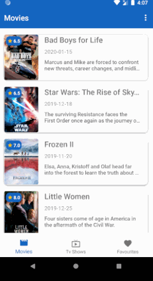

# Movie Catalogue
__Movie Catalogoue__ adalah sebuah app yang menampilkan daftar movie terbaru dan juga detailnya. App ini ditujukan untuk memenuhi submission 2 pada course Menjadi Android Developer Expert dari [dicoding](https://www.dicoding.com/academies/14)

## Preview

## Ketentuan Submission
1. Daftar Film
   - [x] Terdapat 2 (dua) halaman yang menampilkan daftar film (Movies dan Tv Show).
   - [x] Menggunakan Fragment untuk menampung halaman Movies dan Tv Show.
   - [x] Menggunakan RecyclerView untuk menampilkan daftar film dengan jumlah minimal 10 item.
   - [x] Menggunakan TabLayout, BottomNavigationView, atau yang lainnya sebagai navigasi antara halaman Movies dan Tv Show.
2. Detail Film
   - [x] Menampilkan poster dan informasi film pada halaman detail film.
   - [x] Menggunakan Parcelable sebagai interfaces dari obyek yang akan dikirimkan antar Activity atau Fragment.
   - [x] Menggunakan ConstraintLayout untuk menyusun layout.
3. Localization
   - [x] Aplikasi harus mendukung bahasa Indonesia dan bahasa Inggris.

